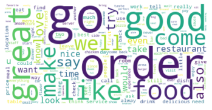

# yelp_reviews_tensorflow


Presented by: Rachel Edwards

## Overview
This is a project to disambiguate three star reviews. This project uses an NlP based binary text classification sgd model. It tags reviews as either positive or negative. The purpose of this is to help companies make the most of their already existing data.

## Business Problem
Most companies have a way to intereact witht heir client base online mowawadays. Those interactions can hold a lot of useful data for most companies. Sometimes the way that data is collected can be confusing do to human error. This project focuses on reviews and rating from users as its source of data. The goal is to use these reviews nd ratings to disambiguate three star reviews. Three star reviews are notoriously tricky to designate as positive or negative due to their more neutral nature. 

## Data
The data for this project uses data from both Yelp and Grubhub. The Yelp data can be found here: Yelp Open Dataset. Instructions on how to access, get and split the rest of the data can be located in the data collection folder. The data takes reviews and splits them into positive and negative categories based on their star ratings. Four and five star data is tagged as positive nad two and one star data is tagged as negative. These two tags make up the binary classificaitons used to predict in this project. 

Negative Wordcloud  

Positive Wordcloud 

## Methods
THe methods included in the project include NLP data cleanning techniques such as part of speech tagging and lemmatization. The modeling is an iterative process that starts as a first simple model that gets built on by picking the right vectorizer and the best hyperparameters for the data I have collected. This model is then meausured by its accuracy in crossfold validtion and presented as a confusion matrix.

## Results
While the model does well on its own test data from Yelp at about 93% accurately, it performs only adequately on the data from Grubhub at 76% accuracy. 

Yelp Model  

Grubhub Model 

## Conclusions
Some conclusions that I have come to are that even though the Grubhub is made up of reviews these reviews to do not reflect the positive to negative ratio that was used when training the model on Yelp data. The Yelp ratio was five positive reviews to two negative reviews. The Grubhub ratio is three negative reviews to two positive reviews. Besdies the ratio mismatch much of the negatively tagged data within the Grubhub dataset can be attributed to bad reivews ofGrubhub itself, particularly its delviery drivers. 

 


### Next Steps
-Making a NER model to create an entitty distinction between Grubhub and the actual business attached to the orders

-Gathering more data to input into another model for better predictions

-Figure out how to deal with the opposite distribution

-Deploy an app in Flask that you can type a review into

## Repository Structure
```
├── data
├── img
├── notebooks
├── src
  ├── yelp.py
  ├── yelp_env.yml
├── README.md
└── yelp_final_notebook.ipynb
```
